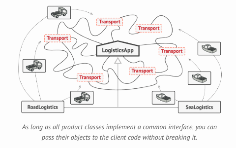
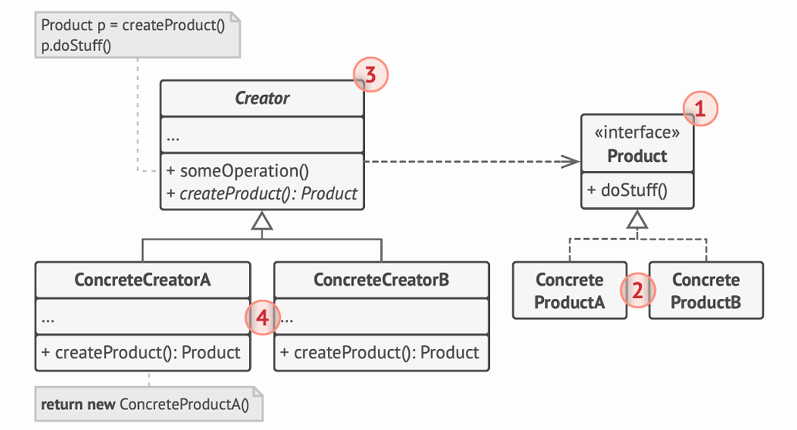

# Factory Method

Provee una interaz para crear objetos en una superclase,
pero permite que las subclases alteren el tipo de objetos que se crean.

## Problema

Imagina que creamos una app para el manejo de logística de una empresa.
La primera versión de la app solo maneja transporte por camiones, entonces el código de la aplicación solo se maneja por la clase `Camion`.

Tras un tiempo, la aplicación se vuelve popular y recibimos peticiones de empresas de transporte aéreo o marítimo para incorporar su transporte a la app.

> ES DIFICIL AGREGAR UNA NUEVA CLASE A UN PROGRAMA SI EL RESTO DEL CÓDIGO YA ESTÁ EMPAREJADO CON LAS CLASES EXISTENTES.

Agregar una clase `Avion` requeriría cambiar **TODA** la codebase. Imaginense entonces agregar luego la clase `Barco`. Esto resultaría en un código enorme, lleno de condicionales que cambia el comportamiento de la app según que transporte usarías.

## Solución

El patrón **Factory Method** sugiere reemplazar las llamadas a constructores
directos por llamadas a un método *factory* especial. Los objetos siguen siendo creados por un operador `new` pero por debajo del método fábrica. Los objetos devueltos por un método fábrica son llamados **productos**.

Esto parece totalmente inútil, pero ahora podemos hacer un **Override** del factory method en las subclases y cambiar la clase de productos creadas por el método.

Hay una pequeña limitación: las sublcases pueden devolver diferentes tipos de productos sólo si estos productos tienen una clase base o interfaz en común. También el factory method debe tener su tipo de retorno declarado como esta interfaz.

Queremos llegar a la siguiente estructura:


## Estructura



1. El producto declara la interfaz, que es común a todos los objetos producidos por el creador y sus subclases.
2. Los productos concretos son diferentes implementaciones de la interfaz de producto.
3. La clase creadora declara el método fábrica que retorna nuevos objetos productos. Es importante que el tipo de retorno de este método matchee la interfaz de producto. \
   Se puede declarar el factory method como abstracto para que todas las subclases implementen su propia version del método. Sino se puede hacer que retorne un producto default.
4. Los creadores contcretos hacen un **override** del factory method así retorna un tipo diferente de producto. El factory method no tiene que **crear** nuevas instancias todo el tiempo, puede retornar también un objeto existente de una cache, una pool de objetos u otra fuente.

## Ejemplo

Tengo un restaurante de cómida rápida **McLovin**, en él se hacen hamburguesas veganas y hamburguesas de carne de vaca. Tenemos una clase `Restaurant` que representa al restaurante y un método `Burger order(String type)` que retorna un producto de tipo `Burger`.

Tenemos la siguiente implementación de `order`:

```Java
public class Restaurant {
    public Burger order(String type) {
        Burger burger = null;
        if ("COW".equals(type)) {
            burger = new CowBurger();
        } else if ("VEGGIE".equals(type)) {
            burger = new VeggieBurger();
        }
        burger.prepare();
        return burger;
    }
}
```

siendo `Burger` una interfaz y `CowBurger`, `VeggieBurger` implementaciones de Burger.

```Java
public interface Burger {
    void prepare();
}
```

```Java
public class CowBurger implements Burger {
    private boolean prepared; 

    public void prepare() {
        // preparacion de burger.
    }
}
```

```Java
public class VeggieBurger implements Burger {
    private boolean prepared; 

    public void prepare() {
        // preparacion de burger.
    }
}
```

Ahora, seguimos teniendo muchos `if`s que debería ser posible eliminar de alguna manera. Y esto es posible gracias al **FACTORY METHOD** pattern.

Hagamos varias cosas. Primero, hagamos que `Restaurant` sea una clase abstracta, e implementemos un método abstracto `createBurger()`. Luego cambiemos la implementacion de `order` a la siguiente:

```Java
public abstract class Restaurant {
    public Burger order() {
        Burger burger = createBurger();
        burger.prepare();
        return burger;
    }

    public abstract Burger createBurger();
}
```

Y ahora creamos las clases `VeggieBurgerRestaurant` y `CowBurgerRestaurant`:

```Java
public class CowBurgerRestaurant extends Restaurant {
    @Override
    public Burger createBurger() {
        return new CowBurger();
    }
}
```

```Java
public class VeggieBurgerRestaurant extends Restaurant {
    @Override
    public Burger createBurger() {
        return new VeggieBurger();
    }
}
```

De esta manera limpiamos bastante el código, solo teniendo que hacer:

```Java
public class Main {
    public static void main(String[] args) {
        Restaurant cowResto = new CowBurgerRestaurant();
        Burger cowBurger = cowResto.orderBurger();

        Restaurant veggieResto = new VeggieBurgerRestaurant();
        Burger veggieBurger = veggieResto.orderBurger();
    }
}
```

## ¿Cuándo usar?

### Cuando no sabemos de antemano los tipos exactos y dependencias de objetos con los que el código va a trabajar

El **Factory Method** separa el código de construcción del producto del código que realmente usa el producto.
De esta manera es más fácil extender el código de construcción de producto independientemente del resto del código

---

### Cuando queres guardar recursos de sistema reusando objetos existentes en vez de reconstruirlos cada vez

Muchas veces se experimenta esta necesidad cuando tratas con objetos grandes y intensivos en recursos, como pueden ser conexiones con bases de datos, sistemas de archivos y recursos de red

---

### Cuando querés proveer a los usuarios de tu librería o framework con una manera de extender sus componentes internas

La herencia es la forma más fácil de extender el comportamiento default de una librería o framework.

Para hacer que un framework reconozca que una subclase debe usarse en vez del componente estándar, es reduciendo el código que construye los componentes a lo largo del framework en un solo factory method, extendiendo ademas el componente en sí mismo

---

## Pros y contras

### PROS

- Se evita el emparejamiento entre el creator y el producto concreto.
- Se mantiene el **principio de responsabilidad única** pues, se puede mover el código de creación del producto a un solo lugar en el programa, haciendo el código más fácil de mantener.
- Se mantiene el **principio de abierto/cerrado**, pues se pueden introducir nuevos tipos de productos al programa sin romper el código de cliente existente.

### CONTRAS

El código se puede volver más complejo debido a que se necesita introducir muchas subclases nuevas para implementar el patrón.

El mejor caso es cuando se introduce el patrón a una jerarquía existente de clases creadoras.

## Relaciones con otros patrones

- Muchos diseños comienzan usando el **Factory Method**, el cual es menos complejo y más customizable con las subclases, y evolucionan a **Abstract Factory**, **Prototype** o **Builder**, los cuales son más flexibles pero más complejos.

- Las clases **Abstract Factory** están basadas normalmente en un set de **Factory Methods**, que usan también **Prototype** para componer métodos en estas clases.

- Se puede usar **Factory Method** acompañado de **Iterator** para permitir que las subclases de colección retornen diferentes tipos de iteradores que son compatibles con las colecciones.
