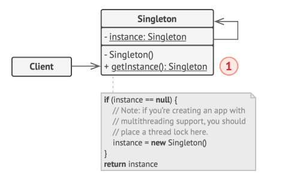

# Singleton

Permite que estemos seguros que hay una sola instancia de una clase,
pero permitiendo que haya un punto de acceso global a ella.

## Problemas

1. Garantizar que exista una única instancia de una clase en todo el programa.

    Queremos controlar el acceso a un recurso compartido, sea una DB o un archivo

2. Proporcionar un punto de acceso global a la instancia.

    Queremos proteger el código de la clase de que sea sobreescrito.

## Solución

Todas las implementaciones de Singleton hacen lo siguiente:

- Hacen al constructor default privado, para que otras clases no puedan utilizar el método `new`.
- Crean un método estático de creación que actúa como el constructor. De esta manera cuando se llama por primera vez construye la instancia con su método privado `new`. En los próximos llamados a la función se utiliza la instancia cacheada.

## Estructura



La clase singleton declara el método getInstance() que retorna la misma instancia de su propia clase.

## Ejemplo

Tenemos una conexión a una **Base de datos**. Su clase de conexión `DatabaseConnection` actúa como un Singleton. Su clase no tiene un constructor público, entonces se debe usar su método `getInstance` si se requiere obtener la db.

```Java
public class Database {
    private static Database instance;

    private Database() {
        // conectar a la base de datos
    }

    public static Database getInstance() {
        if (this.instance == null) {
            acquireThreadLock();
            if (this.instance == null) this.instance = new Database();
        }
        return Database.instance
    }

    public void query(String query) {
        // ...
    }

}
```

```Java
public class App {
    public static void main(String[] args) {
        Database db = Database.getInstance();

        db.query("SELECT * FROM ... ");


        // ...

        Database qb = Database.getInstance();

        System.out.println(qb == db); // true;
    }
}
```

## ¿Cuándo aplico Singleton?

- Cuando una clase de un programa debería tener acceso a solo una instancia de una clase, ya sea una base de datos o un archivo.
- Cuando se necesite un control más estricto sobre las variables globales.

## Pros y Contras

### Pros

- Una clase tiene una única instancia.
- Ganamos un punto de acceso global a esa instancia.
- La instancia singleton se crea solo cuando se quiere acceder a ella por primera vez.

### Contras

- Se rompe el principio de **Single responsibility**. El patrón resuelve dos problemas a la vez.
- Puede enmascarar un mal diseño, por ejemplo, cuando un componente del programa conoce mucho de otro.
- Requiere tratamiento especial en un ambiente multithreaded para que no se creen varias instancias singleton.
- Dificil de hacer Unit Tests.