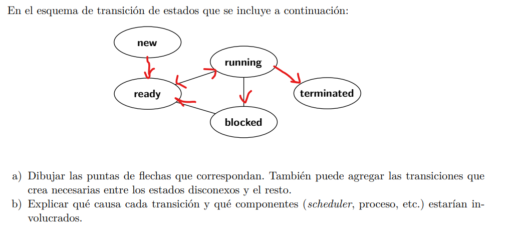

# Practica 1

## Ejercicio 1

Para hacer un cambio de contexto tenemos que:

1. Entrar en modo supervisor/ring 0.
2. Guardar todos los registros, el program counter, el stack pointer, etc. (guardar el estado de ejecución y su contexto).
3. Actualizar el estado de Running a Ready/Blocked (depende de la operacion que provocó el context switch).
4. Cambiamos el address space
5. Restaurar el contexto de ejecución del programa nuevo, actualizando el estado a RUNNING.
6. Salir del modo supervisor para ejecutar el programa.

## Ejercicio 2.a

```C
void Ke_context_switch(PCB* pcb_0, PCB* pcb_1) {
    pcb_0->CPU_TIME = pcb_0->CPU_TIME + ke_current_user_time();
    ke_reset_current_user_time();

    pcb_0->STAT = KE_READY;
    pcb_0->PC = PC;
    pcb_0->R0 = R0;
    ...
    pcb_0->R15 = R15;


    set_current_process(pcb_1->P_ID);
    pcb_1->STAT = KE_RUNNING;

    R0 = pcb_1->R0;
    ...
    R15 = pcb_1->R15;


    PC = pcb_1->PC;
    ret();
}
```

## Ejercicio 4.a



## Ejercicio 4.b

- `NEW` -> `READY`.
    - Cuando creamos un nuevo proceso, nunca se lo comienza a correr inmediatamente, sino que se encola en la cola de procesos, estando listo para correr.
    - Involucra: SO, Scheduler
- `READY` -> `RUNNING`
    - Cuando el proceso está listo para correr, y le toca su quantum de CPU, este se ejecuta, colocándolo en estado Running.
    - Involucra: Scheduler
- `RUNNING` -> `READY`
    - Cuando se acaba el quantum del proceso, y no se ejecutó ninguna operación bloqueante, se encola nuevamente en la cola de procesos hasta que vuelva a tocar su turno.
    - Involucra: Proceso, Scheduler
- `RUNNING` -> `BLOCKED`
    - Cuando el proceso requiere de una operación bloqueante, véase I/O, colocamos el proceso en estado BLOCKED, que significa que el scheduler no lo tiene que considerar para correrlo, sino que salte al próximo.
    - Involucra: Proceso
- `BLOCKED` -> `READY`
    - Una vez terminada la operación bloqueante, volvemos a encolar el proceso en la cola de procesos, por lo que queda en estado READY hasta que toque su turno en el scheduler.
    - Involucra: SO, Proceso
- `RUNNING` -> `TERMINATED`
    - Una vez que el proceso corriendo termine, no se vuelve a encolar en la cola de procesos, sino que se coloca en estado TERMINATED.
    - Involucra: Proceso

## Ejercicio 5.a

```C
int main(void) {
    printf("[ABRAHAM] Hola, nací y soy Abraham\n");
    pid homer_pid = fork();
    if (homer_pid == 0) {
        printf("[HOMERO] Soy Homero, pero chino.\n");

        pid bart_pid = fork();
        if (bart_pid == 0) {
            printf("[BART] Ay Caramba.\n");
            exit(EXIT_SUCCESS);
        }

        pid lisa_pid = fork();
        if (lisa_pid == 0) {
            printf("[LISA] Soy Lisa y soy vegana.\n");
            exit(EXIT_SUCCESS);
        }
        
        pid maggie_pid = fork();
        if (maggie_pid == 0) {
            printf("[MAGGIE] *ruido de chupete*.\n");
            exit(EXIT_SUCCESS);
        }

        exit(EXIT_SUCCESS);
    }
    return EXIT_SUCCESS;
}
```

## Ejercicio 5.b

```C
int main(void) {
    printf("[ABRAHAM] Hola, nací y soy Abraham\n");
    pid homer_pid = fork();
    if (homer_pid == 0) {
        printf("[HOMERO] Soy Homero, pero chino.\n");

        pid bart_pid = fork();
        if (bart_pid == 0) {
            printf("[BART] Ay Caramba.\n");
            exit(EXIT_SUCCESS);
        }

        pid lisa_pid = fork();
        if (lisa_pid == 0) {
            printf("[LISA] Soy Lisa y soy vegana.\n");
            exit(EXIT_SUCCESS);
        }
        
        pid maggie_pid = fork();
        if (maggie_pid == 0) {
            printf("[MAGGIE] *ruido de chupete*.\n");
            exit(EXIT_SUCCESS);
        }

        wait_for_child(bart_pid);
        wait_for_child(lisa_pid);
        wait_for_child(maggie_pid);
        
        exit(EXIT_SUCCESS);
    }
    
    wait_for_child(homer_pid);
    return EXIT_SUCCESS;
}
```

## Ejercicio 6

```C
void system(const char *arg) {
    if (arg == NULL)
        return;
    
    pid child = fork();
    
    if (child == 0) {
        exec(arg);
        exit(EXIT_FAILURE);
    } else {
        wait_for_child(child);
    }   
}
```
